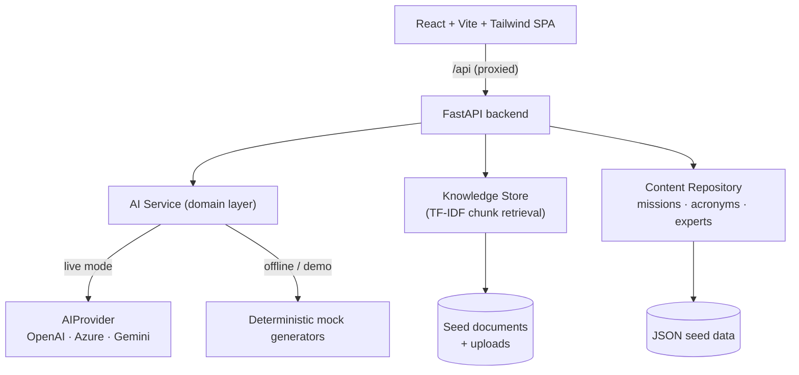

# DB Quest AI

> **Learn faster. Work smarter. Stay compliant — with an AI Digital Colleague.**

An AI-powered web application built for the **Deutsche Bank FutureReady / Global Hackathon 2026** theme
*(applying AI in practice to shape the bank of tomorrow)*. It solves **two** real enterprise problems in
one product:

1. **Knowledge is fragmented** → an **AI Digital Colleague** answers project/process questions with cited
   sources, onboards new joiners, explains acronyms and finds the right expert.
2. **Mandatory training is passive** → an **AI Escape-Room** turns policies and risks into interactive,
   adaptive missions where employees *learn by making realistic decisions*.

The whole app runs **fully offline in a deterministic demo mode with zero API keys**, and transparently
upgrades to a **live LLM** (OpenAI / Azure OpenAI / Google Gemini) when a key is provided — so the demo
never fails on stage.

---

## ✨ Features

| # | Feature | What the AI does | Where |
|---|---------|------------------|-------|
| 1 | **Ask Digital Colleague** | Retrieval-grounded Q&A over team docs, with cited sources & confidence | `/colleague` |
| 2 | **AI Onboarding Buddy** | Generates a structured, day-by-day onboarding plan | `/onboarding` |
| 3 | **AI Acronym Explainer** | Decodes bank acronyms (UBR, SFT, IRT…) with project context | `/acronyms` |
| 4 | **AI Expert Finder** | Suggests contacts by *document ownership & topic match* (not rankings) | `/experts` |
| 5 | **Document Summariser** | Key points, decisions, action items, risks, people mentioned | `/documents` |
| 6 | **Escape-Room Missions** | Adaptive **Game Master**, progressive **hints**, per-decision explanations | `/missions` |
| 7 | **AI Mission Generator** | Turns any topic/policy into a playable mission instantly | `/admin` |
| 8 | **Personalised Learning Report** | Private risk-awareness score, strengths & improvement areas | end of mission |

---

## 🧭 Architecture



**Design principle:** routers depend only on the **AI Service**, which returns identical shapes whether the
brain is a live LLM or the offline mock. This makes the product robust for a live demo and easy to extend.

---

## 🛠 Tech Stack

- **Frontend:** React 18, Vite 5, Tailwind CSS 3, React Router 6 (no heavy UI/icon deps — custom inline SVGs)
- **Backend:** Python 3.10+, FastAPI, Pydantic v2, httpx
- **Retrieval:** dependency-free TF-IDF chunk search (swappable for FAISS/Chroma)
- **AI providers:** OpenAI, Azure OpenAI, Google Gemini — or built-in mock
- **Storage:** JSON seed data + in-memory document store

---

## 🚀 Quick Start (Windows / PowerShell)

**Prerequisites:** Python 3.10+ and Node.js 18+.

```powershell
# 1. One-time setup (creates venv, installs backend + frontend deps)
./setup.ps1

# 2. In terminal A — start the backend (http://localhost:8000)
./start-backend.ps1

# 3. In terminal B — start the frontend (http://localhost:5173)
./start-frontend.ps1
```

Then open **http://localhost:5173**.

### Manual setup (any OS)

```bash
# Backend
cd backend
python -m venv .venv
# Windows:  .venv\Scripts\activate     |   macOS/Linux:  source .venv/bin/activate
pip install -r requirements.txt
cp .env.example .env          # optional
uvicorn main:app --reload --port 8000

# Frontend (new terminal)
cd frontend
npm install
npm run dev
```

> The app works immediately in **demo mode**. No keys required.

---

## 🔌 Enabling live AI (optional)

Edit `backend/.env` and set a provider:

```dotenv
# OpenAI
AI_PROVIDER=openai
OPENAI_API_KEY=sk-...
OPENAI_MODEL=gpt-4o-mini

# — or Azure OpenAI —
AI_PROVIDER=azure
AZURE_OPENAI_API_KEY=...
AZURE_OPENAI_ENDPOINT=https://<resource>.openai.azure.com
AZURE_OPENAI_DEPLOYMENT=<deployment-name>

# — or Google Gemini —
AI_PROVIDER=gemini
GEMINI_API_KEY=...
```

Restart the backend. The sidebar shows **“Live AI · <provider>”** when active. If a live call fails, the
app automatically falls back to the mock so the UX never breaks.

---

## 📁 Project Structure

```
db-quest-ai/
├── README.md
├── setup.ps1 / start-backend.ps1 / start-frontend.ps1
├── docs/
│   ├── ARCHITECTURE.md      # deeper design notes
│   ├── DEMO_SCRIPT.md       # 5-minute pitch + click-through
│   └── API.md               # endpoint reference
├── backend/
│   ├── main.py              # FastAPI app + health
│   ├── requirements.txt
│   ├── .env.example
│   └── app/
│       ├── config.py        # env-driven settings
│       ├── models.py        # Pydantic request/response models
│       ├── ai_provider.py   # OpenAI/Azure/Gemini HTTP clients
│       ├── ai_service.py    # high-level domain methods (live ↔ mock)
│       ├── mock_ai.py       # deterministic offline generators
│       ├── knowledge.py     # TF-IDF document retrieval
│       ├── content.py       # missions/acronyms/experts repository
│       ├── routers/         # missions, colleague, documents
│       └── data/            # missions.json, acronyms.json, experts.json, documents/
└── frontend/
    ├── vite.config.js       # dev proxy /api → :8000
    ├── tailwind.config.js
    └── src/
        ├── App.jsx          # shell + sidebar + routes
        ├── api.js           # typed API client
        ├── components/      # icons + shared UI
        └── pages/           # Dashboard, Missions, MissionPlay, Colleague, …
```

---

## 🤖 AI usage — for judges

**AI to *build* the app:** Copilot / LLMs assisted in generating UI, backend APIs, prompts and sample data.

**AI *inside* the app (the differentiator):**
- Answers employee questions from documents (with sources)
- Summarises documents into decisions/risks/actions
- Generates onboarding plans
- Creates and narrates adaptive escape-room missions
- Adapts hints and explanations to the player's choices
- Produces a personalised, private learning summary

See **[docs/DEMO_SCRIPT.md](docs/DEMO_SCRIPT.md)** for the full pitch and click-through.

---

## 🔐 Security & Responsible AI

- **No individual rankings.** Mission scores are **private to the user**; only anonymised/aggregated team
  insights would be shared in a real deployment.
- **Expert Finder** surfaces *relevant contacts by document ownership/topic* — never performance judgements.
- **Grounded answers.** The Digital Colleague answers from provided context and flags when it doesn't know.
- CORS is restricted to configured origins; answer keys for missions are never sent to the client (evaluation
  is server-side). No secrets are committed (`.env` is git-ignored).

---

## 📌 Limitations (24-hour MVP)

- Document upload supports **text-based files** (`.txt`, `.md`, `.csv`) and pasted text. PDF/DOCX parsing can be
  added with `pypdf` / `python-docx`.
- Retrieval uses TF-IDF for zero-dependency portability; swap in embeddings for production.
- Generated missions and uploaded docs are held **in memory** for the session.

---

## 📄 License

Provided for the Deutsche Bank Global Hackathon 2026. Sample data, names and scenarios are fictitious.
