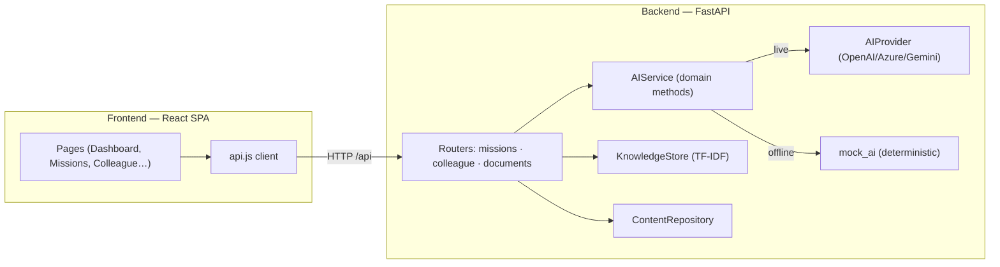

# Architecture — DB Quest AI

## Goals
1. **Never fail on stage.** The app must be fully functional with zero configuration or network.
2. **Real AI, pluggable.** Upgrade to OpenAI/Azure/Gemini by setting one env var.
3. **Enterprise-appropriate.** Grounded answers, private scores, no employee rankings.

## High-level layers

## Key modules (backend)

| Module | Responsibility |
|--------|----------------|
| `main.py` | App wiring, CORS, lifespan (loads seed content + docs), `/api/health` |
| `config.py` | Env-driven `Settings`; `provider_configured` gate |
| `ai_provider.py` | Low-level chat/chat_json for OpenAI, Azure, Gemini via `httpx`; `live` flag |
| `ai_service.py` | High-level domain methods; **chooses live vs mock**; normalises shapes; safe fallback on error |
| `mock_ai.py` | Deterministic generators: missions, game master, hints, evaluation, report, Q&A synthesis, onboarding, expert ranking, summariser |
| `knowledge.py` | Paragraph chunking + TF-IDF scoring (`search`); loads seed documents |
| `content.py` | Loads/holds missions, acronyms, experts; stores generated missions in-memory |
| `routers/*` | Thin HTTP layer; **sanitises missions** (removes answer keys) before sending to client |

## Request flows

### Escape-room decision
1. `GET /api/missions/{id}` → sanitized mission (no `correct`/`feedback`/`clues`).
2. Player picks a choice → `POST /evaluate` → **server** looks up the real choice and returns feedback +
   explanation. Answer keys stay on the server.
3. Front-end records `{stepId, choiceId, correct, risk}` per step (first-attempt correctness, worst risk).
4. On completion → `POST /report` → score = correctness − high-risk penalties − hint penalty + decisiveness bonus.

### Adaptive Game Master
- `POST /interact` with `{message, history}`. In mock mode, keyword intent detection reveals mission
  `clues` (sender/link/request/urgency/channel) and praises safe behaviour. In live mode, the same clues and
  history are passed to the LLM with a "never reveal the answer" system prompt; suggestions parsed from a
  `SUGGESTIONS:` trailer.

### Grounded Q&A
- `POST /colleague/ask` → `KnowledgeStore.search(question, k=4)` returns top chunks with TF-IDF scores.
- Mock mode extracts the most query-relevant sentences and lists deduplicated sources.
- Live mode passes the retrieved chunks as context with an "answer only from context" instruction; sources
  and confidence still come from the retriever (so citations are always faithful).

## Retrieval design
- **Chunking:** split on blank lines, coalesce to ~320+ char paragraphs.
- **Scoring:** `tf` (log-scaled) × `idf` (smoothed) × query term frequency, length-normalised.
- Zero external dependencies; the `search(query, k)` interface is intentionally identical to what an
  embedding store would expose, so FAISS/Chroma can replace it without touching routers.

## Frontend design
- **Shell:** `App.jsx` renders the sidebar + routes; polls `/api/health` to show AI mode.
- **State:** local component state + `localStorage` for mission progress (`dbquest_progress`).
- **UI kit:** `components/ui.jsx` (Badge, PageHeader, RichText, Spinner…) + inline SVG `components/icons.jsx`
  — no icon/UI library, keeping installs fast and offline-friendly.
- **Dev proxy:** Vite proxies `/api` → `:8000`, so the client uses relative URLs (no CORS in dev).

## Security & responsible AI
- Mission answer keys are never serialised to the client.
- Scores are private (client-side only); the report UI explicitly states only aggregated team insights would
  be shared in production.
- Expert Finder returns ownership/topic matches with a non-ranking disclaimer.
- CORS origins are configurable; `.env` is git-ignored.

## Extension points
- **PDF/DOCX ingestion:** add `pypdf`/`python-docx` in `routers/documents.py`.
- **Persistence:** swap in-memory `ContentRepository`/`KnowledgeStore` for SQLite/Postgres + a vector DB.
- **Auth/roles:** gate `/admin` mission generation behind an admin role.
- **Aggregated analytics:** persist anonymised decision outcomes to build the "team heatmap".
